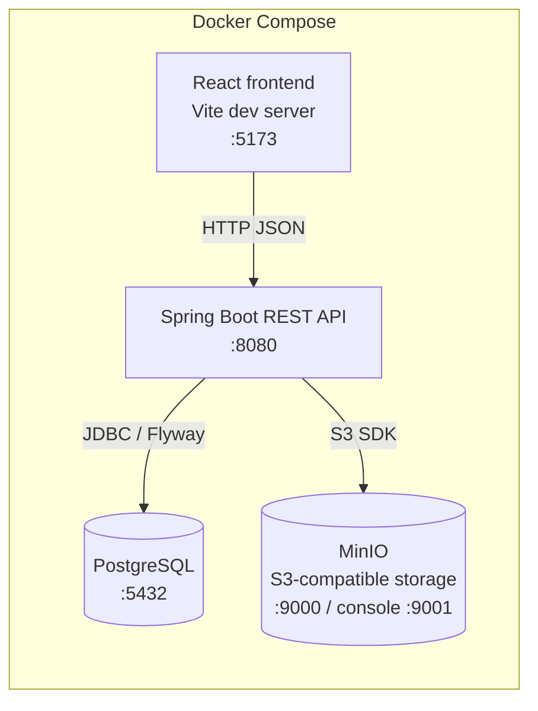

# UniHub

University hub centralising academic life: announcements, class calendar with Google Meet
links, course resources & homework submissions, session recaps for missed classes, and
tuition payment tracking (3 installments with proof-image validation).

Tracked in Jira project **UNIH**: https://raqiouiadil852.atlassian.net/browse/UNIH

## Tech stack

| Layer | Technology |
|-------|-----------|
| Backend | Spring Boot 3, Java 21, Maven, PostgreSQL, Flyway, MinIO |
| Frontend | React 18, TypeScript, Vite, TanStack Query |
| Infra | Docker, GitHub Actions CI/CD → Render |

## Architecture

```
browser → React SPA (Vite dev / nginx) → Spring Boot REST API → PostgreSQL
                                                               → MinIO (file storage)
```

Full docker-compose topology:



## Quick start (local dev)

**Prerequisites:** Docker and Docker Compose (bundled with Docker Desktop, or the
`docker compose` plugin on Linux).

```bash
git clone https://github.com/ADILRAQ/UNIHUB.git
cd UNIHUB
# Create .env at the project root — see "Environment variables" below for the full list.
# Defaults in that table work for local dev with docker compose.
docker compose up --build     # starts api + postgres + minio + frontend
```

| Service | URL |
|---------|-----|
| Frontend | http://localhost:5173 |
| API | http://localhost:8080 |
| API docs (Swagger UI) | http://localhost:8080/api/swagger-ui.html |
| OpenAPI spec (JSON) | http://localhost:8080/api/api-docs |
| MinIO console | http://localhost:9001 |

Health check: `curl http://localhost:8080/api/health`

To stop: `docker compose down` (add `-v` to also drop volumes / reset the database).

## Demo credentials

The base accounts below are seeded from the `ADMIN_*`, `TEACHER_*`, and `STUDENT_*`
environment variables. When running with `SPRING_PROFILES_ACTIVE=dev` (the default in
`docker compose up`), `DemoDataSeeder` also seeds a full demo dataset on first boot —
courses, sessions, announcements, resources, assignments, payments — covering every app
feature.

**Base accounts** (seeded on first boot):

| Role | Email | Password |
|------|-------|----------|
| Admin | admin@unihub.local | changeme-admin |
| Teacher (Alice Martin) | teacher@unihub.local | changeme-teacher |
| Student (Bob Dupont) | student@unihub.local | changeme-student |

**Additional demo accounts** (seeded by `DemoDataSeeder` on first boot in `dev`):

| Role | Email | Password | Group |
|------|-------|----------|-------|
| Teacher (Carol Sow) | teacher2@unihub.local | changeme-teacher2 | L3 Info B |
| Student (David Kim) | student2@unihub.local | changeme-student2 | L3 Info A |
| Student (Emma Touré) | student3@unihub.local | changeme-student3 | L3 Info A |
| Student (Fatima Osei) | student4@unihub.local | changeme-student4 | L3 Info B |
| Student (Hugo Blanc) | student5@unihub.local | changeme-student5 | L3 Info B |
| Student (Inès Bah) | student6@unihub.local | changeme-student6 | L3 Info B |

## Environment variables

Create a `.env` file at the project root (gitignored — never commit it).
For local dev the defaults below work as-is; production requires real secrets.
Required in production:

| Variable | Purpose |
|----------|---------|
| `POSTGRES_PASSWORD` | PostgreSQL password |
| `JWT_SECRET` | HMAC-SHA256 secret (≥ 32 chars) |
| `MINIO_ROOT_USER` | MinIO access key |
| `MINIO_ROOT_PASSWORD` | MinIO secret key |

## Features

- **Announcements** — rich-text posts with comments, read/unread tracking, pin and urgent
  flags; TEACHER creates for their groups, ADMIN for all.
- **Calendar** — weekly timetable templates generate dated sessions; Google Meet links
  per course; cancel / reschedule individual sessions.
- **Resources** — course module browser, file upload/download via MinIO, assignment
  submission with late-flag computation; resubmission replaces.
- **Session Recaps** — recording URL + sanitized notes per past session, linked resources
  and assignments.
- **Payments** — 3 tuition installments per academic year; proof-image upload by students;
  admin approve/reject queue; overdue derived from due date.

## Epics (Jira UNIH-1…9)

| Epic | Domain | Status |
|------|--------|--------|
| UNIH-1 | Project scaffold & CI | Done |
| UNIH-2 | Auth & user management | Done |
| UNIH-3 | Announcements backend | Done |
| UNIH-4 | Announcements frontend | Done |
| UNIH-5 | Calendar & scheduling backend | Done |
| UNIH-6 | Resources & assignments backend | Done |
| UNIH-7 | Payments backend | Done |
| UNIH-8 | Notifications | Descoped for v1 |
| UNIH-9 | Deployment & polish | In progress |

## Alternative: run without Docker

**Prerequisites:** Java 21+, Maven, Node 20+, a local PostgreSQL instance.

**Backend:**

```bash
cd backend
export DB_HOST=localhost DB_PORT=5432 DB_NAME=unihub
export DB_USER=<user> DB_PASSWORD=<password>
export JWT_SECRET=<at-least-32-char-secret>
mvn spring-boot:run
```

**Frontend:**

```bash
cd frontend
echo "VITE_API_URL=http://localhost:8080" > .env
npm install
npm run dev
```

## Project structure

```
UNIHUB/
├── backend/
│   └── src/main/
│       ├── java/com/unihub/
│       │   ├── controller/   REST endpoints
│       │   ├── service/      business logic
│       │   ├── repository/   Spring Data JPA repositories
│       │   ├── model/        JPA entities
│       │   ├── dto/          request/response DTOs
│       │   ├── config/       Spring configuration (CORS, security, OpenAPI)
│       │   └── exception/    global exception handling
│       └── resources/
│           ├── application.yml, application-{dev,prod}.yml
│           └── db/migration/  Flyway SQL migrations (V1__ … Vn__)
├── frontend/
│   └── src/
│       ├── api/          typed axios client + shared API types
│       ├── components/   shared UI (layout, nav, etc.)
│       ├── features/     one folder per domain
│       ├── hooks/        generic TanStack Query hooks
│       └── router.tsx    route definitions
├── docker-compose.yml
├── CONTRIBUTING.md
└── CLAUDE.md              project constitution / locked technical decisions
```

## Contributing

See [CONTRIBUTING.md](./CONTRIBUTING.md) for branching, commit message, pull request,
and code-style conventions, plus how to add a Flyway migration.
