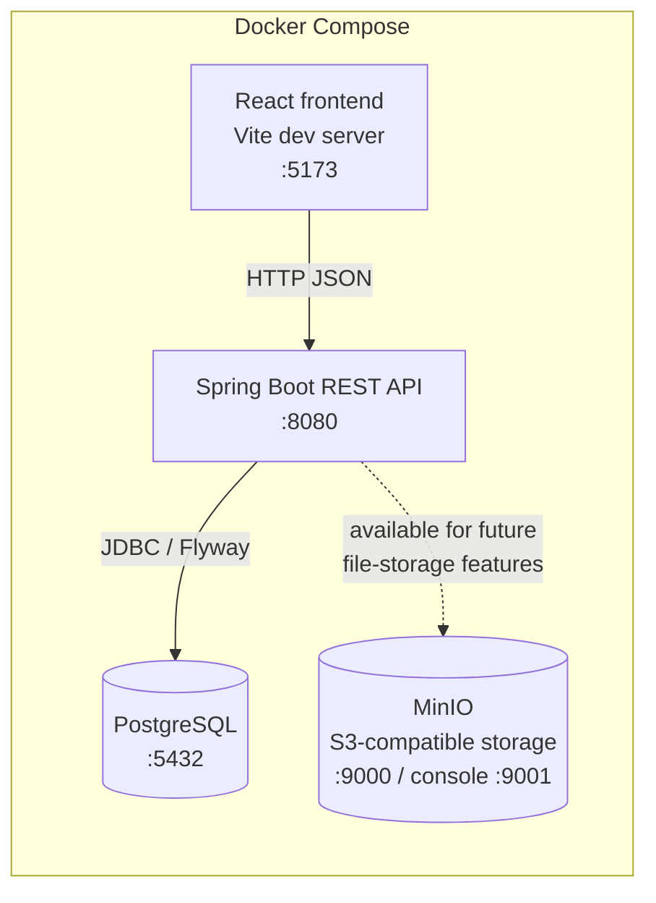

# UniHub

UniHub centralizes a university department's academic life in one app: announcements,
class calendar with Google Meet links, course resources & homework submissions, session
recaps for missed classes, and tuition payment tracking.

Tracked in Jira project **UNIH**: https://raqiouiadil852.atlassian.net/browse/UNIH

**Tech stack:** Spring Boot 3 (Java 21, Maven) · React 18 + TypeScript + Vite ·
TanStack Query · PostgreSQL + Flyway · MinIO · Docker · GitHub Actions.

## Architecture



MinIO has been part of the stack since UNIH-14; no feature currently reads or writes to
it, but the service and its S3-compatible API are wired up and ready for the file
upload/storage stories.

## Prerequisites

**Primary path (recommended):**
- [Docker](https://docs.docker.com/get-docker/) + Docker Compose (bundled with Docker
  Desktop, or the `docker compose` plugin on Linux)

**Only needed for the non-Docker alternative below:**
- Java 21 + Maven (or use the bundled `./mvnw` wrapper)
- Node 20 + npm
- A local PostgreSQL instance

## Getting started (Docker — zero to running app)

1. Clone the repo:

   ```bash
   git clone https://github.com/<org>/UNIHUB.git
   cd UNIHUB
   ```

2. Copy the root env file and adjust values if you want (the defaults work out of the
   box for local dev):

   ```bash
   cp .env.example .env
   ```

   `POSTGRES_*` and `MINIO_*` are freely adjustable here. `VITE_API_URL` is **not**
   currently wired into the `frontend` container — `docker-compose.yml` hardcodes it to
   `http://localhost:8080` — so editing it in the root `.env` has no effect on the
   Docker path. It only takes effect via `frontend/.env` when running the frontend
   outside Docker (see the non-Docker alternative below).

3. Start the stack (add `--build` the first time, or whenever a Dockerfile changes):

   ```bash
   docker compose up --build
   ```

   This brings up, in order (each service waits on its dependency's healthcheck):
   `postgres` → `minio` → `api` (runs Flyway migrations on boot) → `frontend`.

4. Open the app:
   - Frontend: http://localhost:5173
   - API: http://localhost:8080 — health check: `curl http://localhost:8080/api/health`

To stop everything: `docker compose down` (add `-v` to also drop the named volumes and
start from a clean database/object store next time).

> **Note on published ports:** `postgres` (5432) and `minio` (9000/9001) publish their
> ports to the host so you can connect with `psql`, a GUI DB client, or the MinIO
> console directly during local development. This is a local-dev convenience only —
> don't carry it into a production deploy configuration, where the database and object
> store should stay on the internal network and not be exposed publicly.

## Getting started (without Docker)

Run Postgres yourself (locally installed or any other container), then:

**Backend:**

```bash
cd backend
export DB_HOST=localhost DB_PORT=5432 DB_NAME=unihub
export DB_USER=unihub DB_PASSWORD=changeme   # match your local Postgres
mvn spring-boot:run   # defaults to the "dev" profile
```

`DB_USER` and `DB_PASSWORD` are required (no defaults); `DB_HOST`, `DB_PORT`, and
`DB_NAME` fall back to `localhost` / `5432` / `unihub` if unset. Flyway runs
automatically on startup. See `backend/src/main/resources/application.yml` and
`application-dev.yml` for the full set of settings.

**Frontend:**

```bash
cd frontend
cp .env.example .env   # sets VITE_API_URL=http://localhost:8080
npm install
npm run dev
```

## Project structure

```
UNIHUB/
├── backend/
│   └── src/main/
│       ├── java/com/unihub/
│       │   ├── controller/   REST endpoints
│       │   ├── service/      business logic
│       │   ├── repository/   Spring Data JPA repositories
│       │   ├── model/        JPA entities
│       │   ├── dto/          request/response DTOs (never expose entities directly)
│       │   ├── config/       Spring configuration (CORS, security, etc.)
│       │   └── exception/    global exception handling
│       └── resources/
│           ├── application.yml, application-{dev,prod}.yml
│           └── db/migration/  Flyway SQL migrations
├── frontend/
│   └── src/
│       ├── api/          typed axios client + shared API types
│       ├── components/   shared UI (layout, nav, etc.)
│       ├── features/     one folder per domain (health, home, ...)
│       ├── hooks/        generic TanStack Query hooks (useGetData, useGetPaginatedData, usePostData)
│       └── router.tsx    route definitions
├── docker-compose.yml     orchestrates postgres + minio + api + frontend
├── .env.example           documents every root-level environment variable
├── CONTRIBUTING.md        branching, commits, PR, and code-style conventions
└── CLAUDE.md              full project constitution / locked technical decisions
```

## Contributing

See [CONTRIBUTING.md](./CONTRIBUTING.md) for branching, commit message, pull request,
and code-style conventions, plus how to add a Flyway migration.
