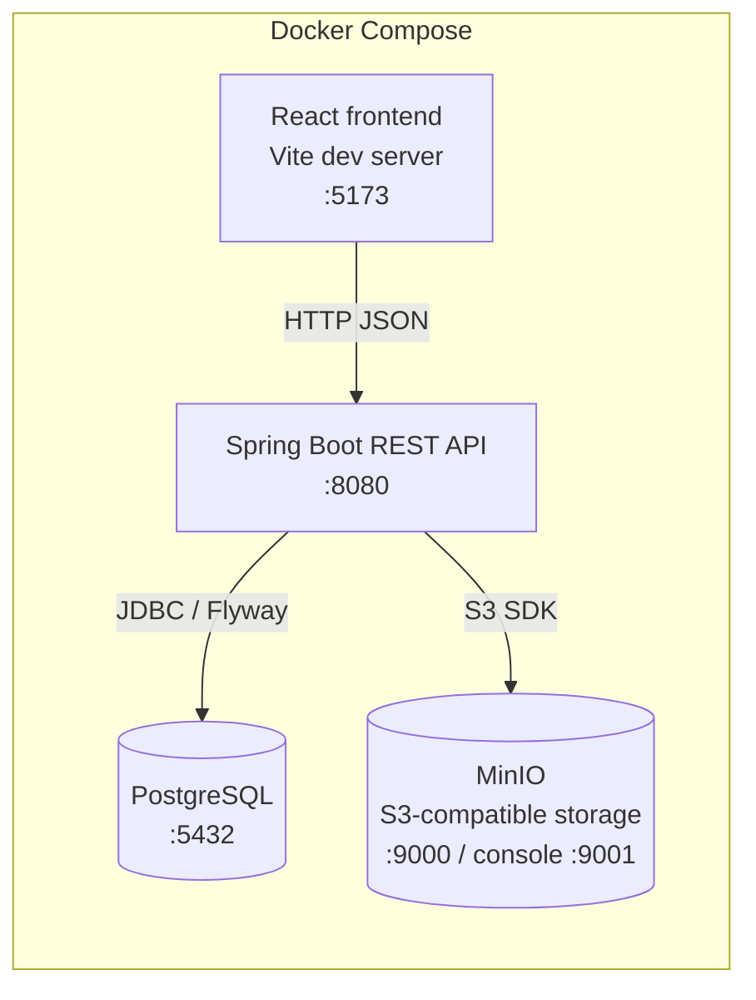

# UniHub

University hub centralising academic life: announcements, class calendar with Google Meet
links, course resources & homework submissions, session recaps for missed classes, and
tuition payment tracking (3 installments with proof-image validation).

Tracked in Jira project **UNIH**: https://raqiouiadil852.atlassian.net/browse/UNIH

## Tech stack

| Layer | Technology |
|-------|-----------|
| Backend | Spring Boot 3, Java 21, Maven, PostgreSQL, Flyway, MinIO |
| Frontend | React 18, TypeScript, Vite, TanStack Query |
| Infra | Docker, GitHub Actions CI, Railway (auto-deploy on merge to `main`) |

## Architecture

```
browser → React SPA (Vite dev / nginx) → Spring Boot REST API → PostgreSQL
                                                               → MinIO (file storage)
```

Full docker-compose topology:



## Quick start (local dev)

**Prerequisites:** Docker and Docker Compose (bundled with Docker Desktop, or the
`docker compose` plugin on Linux).

```bash
git clone https://github.com/ADILRAQ/UNIHUB.git
cd UNIHUB
# Create .env at the project root — see "Environment variables" below for the full list.
# Defaults in that table work for local dev with docker compose.
docker compose up --build     # starts api + postgres + minio + frontend
```

| Service | URL |
|---------|-----|
| Frontend | http://localhost:5173 |
| API | http://localhost:8080 |
| API docs (Swagger UI) | http://localhost:8080/api/swagger-ui.html |
| OpenAPI spec (JSON) | http://localhost:8080/api/api-docs |
| MinIO console | http://localhost:9001 |

Health check: `curl http://localhost:8080/api/health`

To stop: `docker compose down` (add `-v` to also drop volumes / reset the database).

## Demo credentials

The base accounts below are seeded from the `ADMIN_*`, `TEACHER_*`, and `STUDENT_*`
environment variables. When running with `SPRING_PROFILES_ACTIVE=dev` (the default in
`docker compose up`), `DemoDataSeeder` also seeds a full demo dataset on first boot —
courses, sessions, announcements, resources, assignments, payments — covering every app
feature.

**Base accounts** (seeded on first boot):

| Role | Email | Password |
|------|-------|----------|
| Admin | admin@unihub.local | changeme-admin |
| Teacher (Alice Martin) | teacher@unihub.local | changeme-teacher |
| Student (Bob Dupont) | student@unihub.local | changeme-student |

**Additional demo accounts** (seeded by `DemoDataSeeder` on first boot in `dev`):

| Role | Email | Password | Group |
|------|-------|----------|-------|
| Teacher (Carol Sow) | teacher2@unihub.local | changeme-teacher2 | L3 Info B |
| Student (David Kim) | student2@unihub.local | changeme-student2 | L3 Info A |
| Student (Emma Touré) | student3@unihub.local | changeme-student3 | L3 Info A |
| Student (Fatima Osei) | student4@unihub.local | changeme-student4 | L3 Info B |
| Student (Hugo Blanc) | student5@unihub.local | changeme-student5 | L3 Info B |
| Student (Inès Bah) | student6@unihub.local | changeme-student6 | L3 Info B |

## Environment variables

Create a `.env` file at the project root (gitignored — never commit it). `docker compose`
reads it and passes the values to the containers. The example values below reproduce the
demo credentials above; production (Railway) must use real secrets set as service variables.

| Variable | Example (local dev) | Purpose |
|----------|---------------------|---------|
| `POSTGRES_USER` | `unihub` | PostgreSQL user (compose also passes it to the API as `DB_USER`) |
| `POSTGRES_PASSWORD` | `unihub` | PostgreSQL password (`DB_PASSWORD`) |
| `POSTGRES_DB` | `unihub` | Database name (`DB_NAME`) |
| `MINIO_ROOT_USER` | `minioadmin` | MinIO access key (`MINIO_ACCESS_KEY`) |
| `MINIO_ROOT_PASSWORD` | `minioadmin` | MinIO secret key (`MINIO_SECRET_KEY`) |
| `JWT_SECRET` | any string ≥ 32 chars | HMAC-SHA256 signing secret |
| `ADMIN_EMAIL` / `ADMIN_PASSWORD` / `ADMIN_FULL_NAME` | `admin@unihub.local` / `changeme-admin` / `Admin` | Admin account seeded on first boot |
| `TEACHER_EMAIL` / `TEACHER_PASSWORD` / `TEACHER_FULL_NAME` | `teacher@unihub.local` / `changeme-teacher` / `Alice Martin` | Base teacher account (optional) |
| `STUDENT_EMAIL` / `STUDENT_PASSWORD` / `STUDENT_FULL_NAME` | `student@unihub.local` / `changeme-student` / `Bob Dupont` | Base student account (optional) |

Optional, with defaults in `application.yml`:

| Variable | Default | Purpose |
|----------|---------|---------|
| `SPRING_PROFILES_ACTIVE` | `dev` | `dev` also seeds the demo dataset; use `prod` in production |
| `JWT_EXPIRATION_HOURS` | `16` | Access-token lifetime |
| `SEED_CLASS_GROUP` | `L3 Info A` | Class group of the base student account |
| `DB_HOST` / `DB_PORT` | `localhost` / `5432` | Database location (set by compose) |
| `MINIO_ENDPOINT` / `MINIO_BUCKET` | `http://localhost:9000` / `unihub` | Object storage location and bucket (created on startup) |
| `FRONTEND_URL` | — | **prod only:** allowed CORS origin (the deployed frontend URL) |
| `VITE_API_URL` | `http://localhost:8080` | Frontend build-time API base URL |

## Features

- **Announcements** — rich-text posts with comments, read/unread tracking, pin and urgent
  flags; TEACHER creates for their groups, ADMIN for all.
- **Calendar** — weekly timetable templates generate dated sessions; Google Meet links
  per course; cancel / reschedule individual sessions.
- **Resources** — course module browser, file upload/download via MinIO, assignment
  submission with late-flag computation; resubmission replaces.
- **Session Recaps** — recording URL + sanitized notes per past session, linked resources
  and assignments.
- **Payments** — 3 sequential tuition installments per academic year and per class group
  (amounts in MAD); students upload a proof image/PDF for the current installment; teachers
  and admins approve or reject from a queue, and approval unlocks the next installment;
  overdue derived from the due date (department timezone `Africa/Casablanca`).
- **Admin console** — single-user creation, CSV bulk import with temporary passwords
  (forced change at first login), user and class-group management. Teachers can create,
  import and manage students in any class group.

## Epics (Jira UNIH-1…9)

| Epic | Domain | Status | Report |
|------|--------|--------|--------|
| UNIH-1 | Project foundation & infrastructure | Done | [epic-01](docs/reports/epic-01-foundation-and-infrastructure.md) |
| UNIH-2 | Authentication & user management | Done | [epic-02](docs/reports/epic-02-authentication-and-user-management.md) |
| UNIH-3 | Announcements & communication | Done | [epic-03](docs/reports/epic-03-announcements-and-communication.md) |
| UNIH-4 | Calendar & scheduling | Done | [epic-04](docs/reports/epic-04-scheduling-and-calendar.md) |
| UNIH-5 | Course resources management | Done | [epic-05](docs/reports/epic-05-course-resources.md) |
| UNIH-6 | Missed class recovery (session recaps) | Done | [epic-06](docs/reports/epic-06-session-recaps.md) |
| UNIH-7 | Payments tracking (3 installments) | Done | [epic-07](docs/reports/epic-07-payments-tracking.md) |
| UNIH-8 | Notifications & reminders | Descoped for v1 | — |
| UNIH-9 | Deployment, docs & delivery | Done except the live smoke pass (UNIH-46) | [epic-09](docs/reports/epic-09-deployment-docs-delivery.md) |

## Alternative: run without Docker

**Prerequisites:** Java 21+, Maven, Node 20+, a local PostgreSQL instance.

**Backend:**

```bash
cd backend
export DB_HOST=localhost DB_PORT=5432 DB_NAME=unihub
export DB_USER=<user> DB_PASSWORD=<password>
export JWT_SECRET=<at-least-32-char-secret>
mvn spring-boot:run
```

**Frontend:**

```bash
cd frontend
echo "VITE_API_URL=http://localhost:8080" > .env
npm install
npm run dev
```

## Project structure

```
UNIHUB/
├── backend/
│   └── src/main/
│       ├── java/com/unihub/
│       │   ├── controller/   REST endpoints
│       │   ├── service/      business logic
│       │   ├── repository/   Spring Data JPA repositories
│       │   ├── model/        JPA entities
│       │   ├── dto/          request/response DTOs
│       │   ├── config/       Spring configuration (CORS, security, OpenAPI)
│       │   └── exception/    global exception handling
│       └── resources/
│           ├── application.yml, application-{dev,prod}.yml
│           └── db/migration/  Flyway SQL migrations (V1__ … Vn__)
├── frontend/
│   └── src/
│       ├── api/          typed axios client + shared API types
│       ├── components/   shared UI (layout, nav, etc.)
│       ├── features/     one folder per domain
│       ├── hooks/        generic TanStack Query hooks
│       └── router.tsx    route definitions
├── docs/reports/         one report per delivered epic
├── docker-compose.yml       local dev stack
├── docker-compose.prod.yml  production images, for local verification
├── CONTRIBUTING.md
└── CLAUDE.md              project constitution / locked technical decisions
```

## Contributing

See [CONTRIBUTING.md](./CONTRIBUTING.md) for branching, commit message, pull request,
and code-style conventions, plus how to add a Flyway migration.
