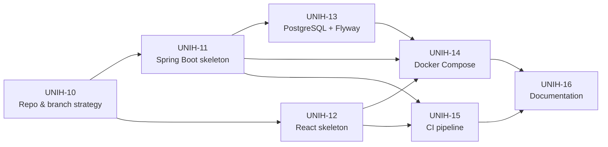
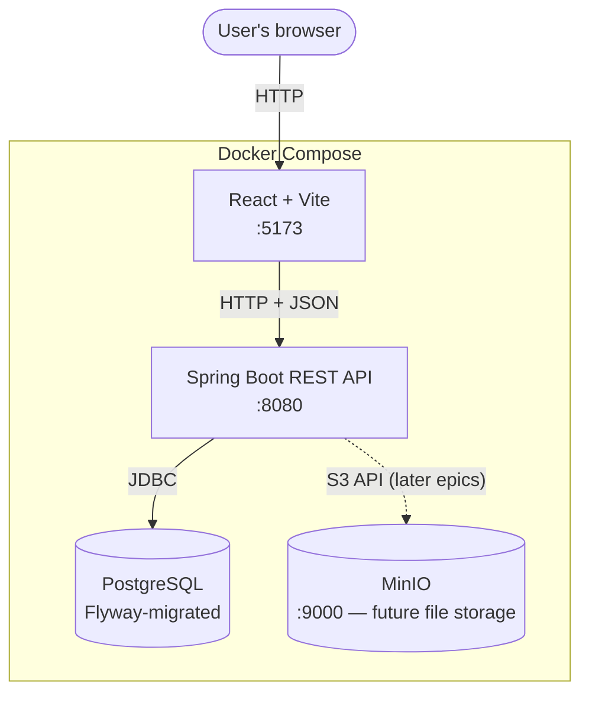
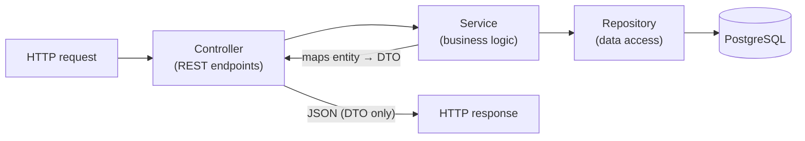
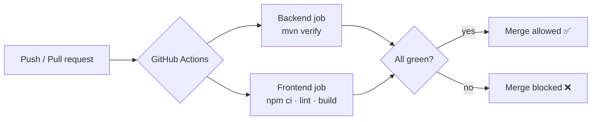

# Epic 1 — Project Foundation & Infrastructure

**Jira epic:** UNIH-1  ·  **Stories:** UNIH-10 → UNIH-16 (7 stories, all delivered)
**Outcome:** A new contributor can clone the repository and run the entire application
— React frontend, Spring Boot API, PostgreSQL, MinIO — with a single `docker compose up`.

---

## 1. Goal of the epic

Before any real feature could be built, the project needed a solid, reproducible
foundation: one repository holding both the backend and frontend, a running database
with a disciplined way to evolve its schema, everything containerised so it runs the
same on any machine, automated checks on every change, and documentation so the setup
isn't locked in one person's head. Epic 1 delivers exactly that skeleton — it produces
no user-facing feature, but every later epic is built on top of it.

## 2. Stories delivered

The seven stories were built in dependency order — the repository first, then the two
skeletons in parallel, then the database, then the containers that tie everything
together, then CI, and finally the documentation:

| Story | What it delivered |
|-------|-------------------|
| **UNIH-10** — Monorepo & branch strategy | GitHub repository with `backend/` + `frontend/` layout, root `.gitignore`/`.editorconfig`, and `CONTRIBUTING.md` defining the branch naming, commit conventions, and pull-request rules the whole project follows. |
| **UNIH-11** — Spring Boot backend skeleton | Spring Boot 3 / Java 21 / Maven project, layered into `controller → service → repository` (+ `model`, `dto`, `config`, `exception`), a `GET /api/health` endpoint, a global exception handler with a consistent error JSON shape, and dev/prod configuration profiles. |
| **UNIH-12** — React + TypeScript frontend | Vite + React 18 + TypeScript app with routing, a base layout, and a single typed API client. Established **TanStack Query** with reusable generic data-fetching hooks (`useGetData`, `useGetPaginatedData`, `usePostData`) as the standard, so no feature ever hand-writes fetching logic. |
| **UNIH-13** — PostgreSQL + Flyway | Connected the backend to PostgreSQL and set up **Flyway** for versioned schema migrations (`V1__baseline.sql` creating the initial `users` table). Database credentials come only from environment variables. |
| **UNIH-14** — Dockerise the stack | Dockerfiles for backend and frontend plus a `docker-compose.yml` orchestrating PostgreSQL, MinIO, the API, and the frontend, with health-gated startup order and a documented `.env.example`. |
| **UNIH-15** — CI pipeline | GitHub Actions workflow running on every push/pull request: a backend job (`mvn verify`) and a frontend job (`npm ci && npm run lint && npm run build`). A failing build blocks the merge. |
| **UNIH-16** — Documentation | A README that takes a newcomer from zero to a running app, an architecture diagram (React → Spring Boot → PostgreSQL, all in Docker), and a fleshed-out `CONTRIBUTING.md`. |

## 3. Key technical decisions and why

- **Monorepo (backend + frontend in one repository).** Keeps the API and UI versioned
  together, so a change that spans both is one coherent unit of history.
- **Flyway for all schema changes, never manual SQL or Hibernate auto-DDL.** Every schema
  change is a numbered, reviewed migration file that runs automatically and identically in
  every environment. The database uses `ddl-auto: validate`, meaning the app refuses to
  start if the code and the migrated schema disagree — a mistake is caught immediately.
- **DTOs at every API boundary.** The database entities are never exposed directly in API
  responses; each endpoint has a dedicated request/response type. This keeps the internal
  data model free to change without breaking the API contract.
- **Secrets only via environment variables.** No password, key, or connection string is
  ever written into source or committed. A checked-in `.env.example` documents every
  variable; the real `.env` is git-ignored.
- **A single typed frontend data-fetching pattern.** All server communication goes through
  one API client and three reusable hooks, so caching, loading/error states, and later the
  authentication token are handled in one place instead of being re-implemented per screen.
- **Build-only CI for v1.** The pipeline compiles and lints everything on every change; a
  test suite isn't required yet, but because it runs `mvn verify`, any tests added later are
  enforced automatically with no configuration change.

## 4. How the pieces fit together

Everything runs in containers wired together by `docker-compose.yml`. The browser talks
to the React dev server, which calls the Spring Boot API, which reads and writes
PostgreSQL. MinIO is present for the file-storage features of later epics.

The backend only starts once the database's health check passes; the database's data
lives in a named volume so it survives restarts.

**The backend follows a strict layered structure**, so responsibilities never blur —
requests flow inward and data is translated to DTOs before it leaves:

**On every push and pull request, GitHub Actions rebuilds and checks the whole project;**
a red check blocks the merge:

## 5. Quality process

Because the project deliberately has no automated test suite in v1, **a mandatory review
step is the quality gate**: every story's changes were checked against its acceptance
criteria — and where possible by actually running the result (starting the server and
curling the health endpoint, bringing the full Docker stack up, triggering a real CI run,
and following the README's own instructions from scratch) — before being merged. Each
pull request confirmed every acceptance criterion explicitly.

## 6. Result

At the end of Epic 1 the project is a working, self-documenting, fully containerised
skeleton: `git clone`, `cp .env.example .env`, `docker compose up`, and the stack is
live at `http://localhost:5173` (UI) and `http://localhost:8080` (API). This foundation
made every subsequent epic a matter of adding features rather than fighting setup.
