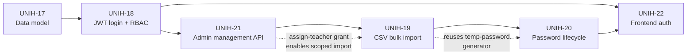
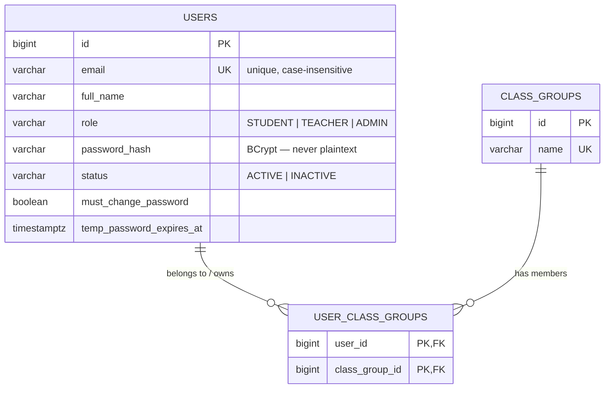
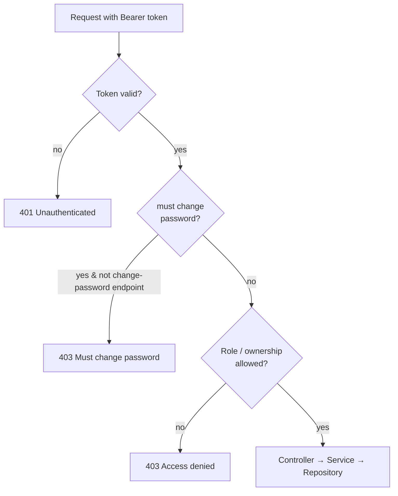
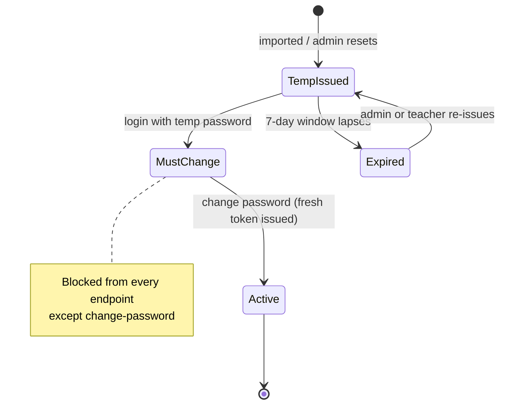

# Epic 2 — Authentication & User Management

**Jira epic:** UNIH-2  ·  **Stories:** UNIH-17 → UNIH-22 (6 stories, all delivered)
**Outcome:** A complete, working authentication system — accounts, secure login,
role-based permissions, bulk account creation, a forced-password-change lifecycle, and
the front-end screens that drive all of it. This is the first epic the end user can
actually log into and use.

---

## 1. Goal of the epic

Epic 1 produced a running but "public" skeleton. Epic 2 turns it into a real,
access-controlled application: users with roles (student, teacher, admin), secure
email + password login, permissions enforced on every endpoint, a way for admins and
teachers to create many accounts at once from a spreadsheet, and a safe first-login flow
where issued temporary passwords must be changed. Every future epic depends on this,
because from here on every screen needs to know who is logged in and every endpoint needs
to check what they are allowed to do.

## 2. Stories delivered (in implementation order)

The stories were deliberately implemented in dependency order — **17 → 18 → 21 → 19 → 20
→ 22** — rather than by Jira number, because bulk import (19) needs the "assign teacher to
a class group" capability from the admin API (21), and the password-lifecycle work (20)
reuses the temporary-password generator built in (19).



| Story | What it delivered |
|-------|-------------------|
| **UNIH-17** — Data model | Flyway migrations adding the authentication columns to `users` (`password_hash`, `status`, `must_change_password`, `temp_password_expires_at`) and creating `class_groups` and the `user_class_groups` membership table, plus the JPA entities and repositories. |
| **UNIH-18** — JWT login + RBAC | Spring Security configured as a stateless JWT resource server: `POST /api/auth/login` issues a signed token carrying the user's id, email, and role; a filter validates the token on every request; role-based rules protect endpoints; passwords hashed with BCrypt; the initial admin account is seeded from environment variables. |
| **UNIH-21** — Admin management API | Admin-only endpoints to list/search/filter users (paginated), view a profile, deactivate/reactivate accounts, and full CRUD for class groups — including assigning a teacher to a group, which grants that teacher the right to import students into it. |
| **UNIH-19** — CSV bulk import | `POST /api/users/import` accepts a CSV and creates many accounts in one request, each with a random temporary password; the response lists the credentials **once**. Invalid or duplicate rows are reported line-by-line without failing the whole import. Teachers can only import students into their own groups. |
| **UNIH-20** — Password lifecycle | Users holding a temporary password are blocked from every endpoint except "change password" until they set a real one; expired temporary passwords block login with a clear message; admins/teachers can re-issue a temporary password (shown once). |
| **UNIH-22** — Frontend auth | Login and change-password screens, an auth context storing the token, automatic token attachment on API calls, role-based route guards, and a navbar showing the logged-in user with logout — the UI that makes all of the above usable. |

## 3. The data model

Three tables carry the whole identity system. A user has a role and a status; class
groups are cohorts; and the `user_class_groups` table links them — a **teacher's** row in
it means "owns/can import into this group", a **student's** row means "is a member of this
group".



## 4. Key technical decisions and why

- **Single JWT access token, no refresh token.** The system issues one signed token (12–24
  h lifetime) that carries the user's identity and role as claims. Every request is
  authorised from the token itself with no database lookup, which keeps the API stateless
  and simple. When a user changes their password, a fresh token is issued to update their
  state, since there is no separate refresh mechanism.
- **Passwords are only ever stored as BCrypt hashes.** No real password is stored anywhere
  in the database — only a one-way hash. The bootstrap admin password lives solely in the
  environment file; imported users' temporary passwords are shown once in the API response
  and never persisted in readable form.
- **Role-based access enforced on every endpoint**, both by URL rules and by
  method-level checks. A teacher, for example, can regenerate a password only for a student
  in a class group they own — never for another teacher or an admin.
- **Class groups must exist before import; membership carries meaning.** A teacher's
  membership row in `user_class_groups` *is* their permission to import into that group —
  no separate permissions table. A CSV row naming an unknown group is a per-row error, not
  a silently created group.
- **Bulk import reports errors per row without losing good rows.** Each row is created in
  its own small transaction, so one bad row (duplicate email, unknown group, malformed
  data) can never roll back the other successful rows in the same request.
- **Forced password change is enforced from the token claim.** A lightweight filter reads
  the "must change password" flag already inside the JWT — no per-request database hit —
  and blocks everything except the change-password endpoint until it is cleared.

## 5. How the pieces fit together

**Logging in** exchanges an email + password for a signed token that carries the user's
identity and role:

```mermaid
sequenceDiagram
    actor U as User (browser)
    participant API as Spring Boot API
    participant DB as PostgreSQL
    U->>API: POST /api/auth/login (email, password)
    API->>DB: find user by email (case-insensitive)
    DB-->>API: user + BCrypt hash
    API->>API: verify password (BCrypt)
    alt valid
        API->>API: issue signed JWT<br/>(id, email, role, mustChangePassword)
        API-->>U: 200 + token
    else invalid
        API-->>U: 401 (generic — no field revealed)
    end
    Note over U,API: Every later request carries<br/>Authorization: Bearer &lt;token&gt;
```

**Every subsequent request** is authorised from the token alone — no database lookup for
identity — then passes a role/ownership check and the forced-password gate before
reaching a controller:



**The temporary-password lifecycle** — from a bulk-imported account to a fully active one:



On the frontend, the token is stored and automatically attached to every request; route
guards redirect an unauthenticated user to login, force a temporary-password user to the
change-password screen, and keep each role to its own sections.

## 6. Quality process — where the review gate proved its value

Every story was reviewed against its acceptance criteria and, for this security-critical
epic, verified against a **live running instance** — not just by reading the code. That
review step caught several genuine issues that "looks-correct" code would otherwise have
shipped:

- **A login timing side-channel (UNIH-18):** the login responses were identical for a
  wrong password vs. an unknown email, but the *response time* was not — an unknown email
  skipped the (slow) password-hash comparison. That timing gap would have let an attacker
  discover which email addresses have accounts. Fixed so both paths do equal work.
- **A duplicate-account bug (UNIH-19):** importing `BOB@x.com` when `bob@x.com` already
  existed created a second account, because the duplicate check was case-sensitive. Fixed
  with case-insensitive checks and, later, a database-level case-insensitive uniqueness
  constraint.
- **A force-logout bug in the UI (UNIH-22):** mistyping the *current* password on the
  change-password screen logged the user out entirely instead of showing an inline error.
  Fixed and then confirmed in a real browser.

Each was found, fixed, and re-verified before merge. Documenting this is deliberate: the
review-and-verify discipline is as much a part of "how the project was realized" as the
code itself.

## 7. Result

At the end of Epic 2 the application has a full, secure identity system. An administrator
logs in with the seeded account, creates class groups, bulk-imports students and teachers
from a CSV, and hands out the generated temporary passwords; each new user logs in, is
forced to set a real password, and then lands in a role-appropriate area of the app —
all enforced consistently on both the server and the interface. This was verified end to
end in a real browser against the full running stack.
