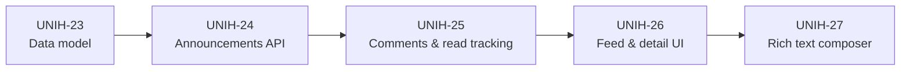
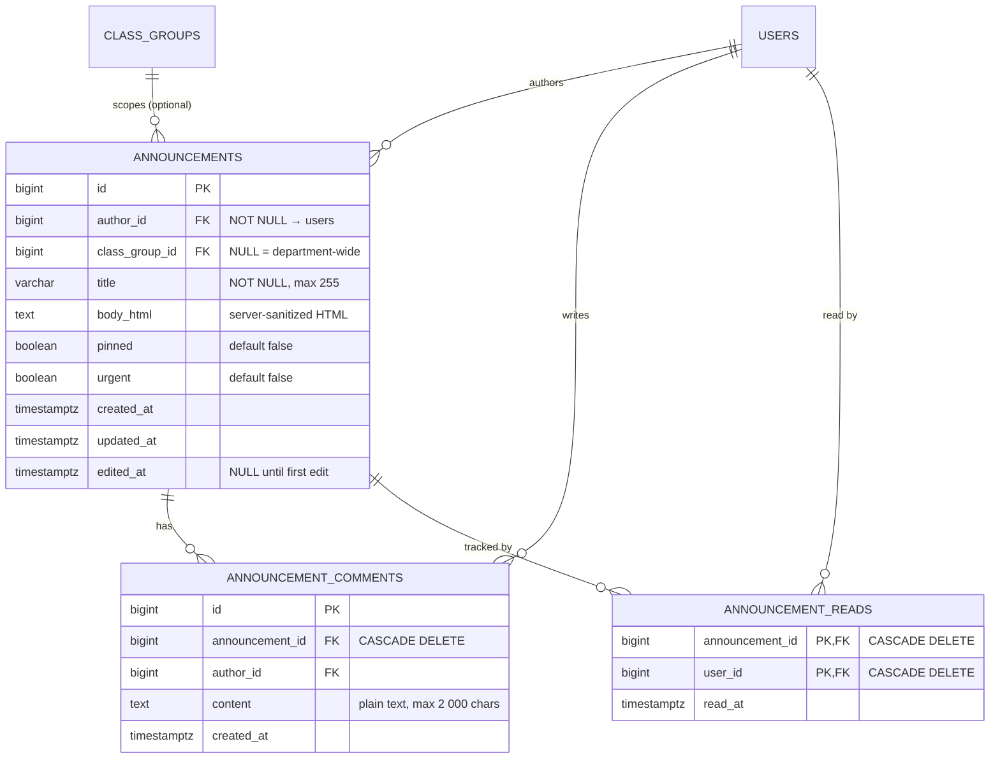
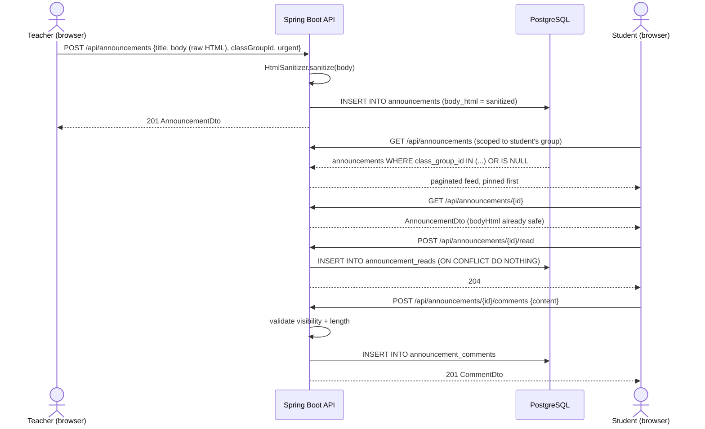
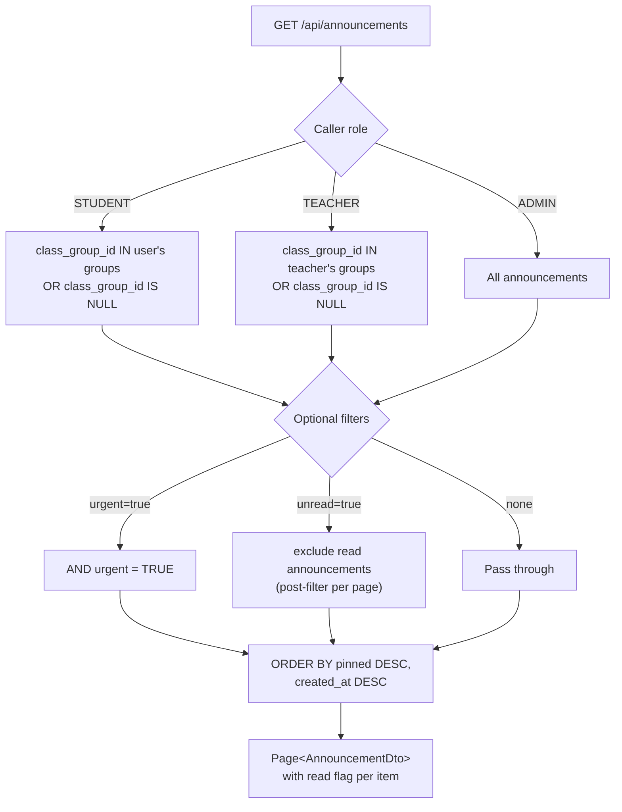
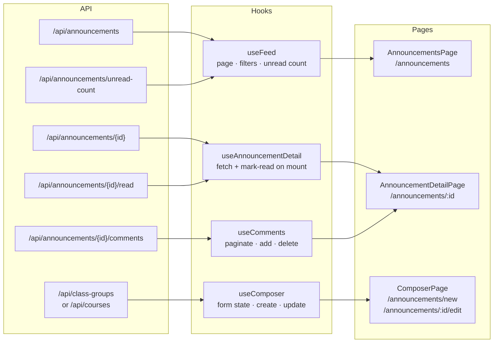

# Epic 3 — Announcements & Communication

**Jira epic:** UNIH-3  ·  **Stories:** UNIH-23 → UNIH-27 (5 stories, all delivered)
**Outcome:** A full in-app announcements system that replaces WhatsApp for department
communication — teachers and admins post rich-formatted announcements to their class
groups, students read and comment on them, unread badges keep attention on what is new,
and every piece of HTML is sanitized server-side before storage.

---

## 1. Goal of the epic

Before this epic, the only communication channel was external (WhatsApp groups). There
was no audit trail, no scoping by class group, and no way for students to ask questions
in context. Epic 3 replaces this entirely: teachers post formatted announcements to their
class groups, admins can post department-wide, students see a single filtered feed with
unread counts and can comment. The system is secure by design — no raw HTML ever reaches
the database without server-side sanitization.

## 2. Stories delivered (in implementation order)

Stories were implemented in strict dependency order — schema before API, API before UI:



| Story | PR | What it delivered |
|-------|----|-------------------|
| **UNIH-23** — Data model | [#25](https://github.com/ADILRAQ/UNIHUB/pull/25) | Flyway migration V8: three tables — `announcements` (author, class group scope, title, sanitized HTML body, pinned/urgent flags, timestamps, edited_at), `announcement_comments` (plain text, cascades on delete), `announcement_reads` (composite PK per user/announcement). Five indexes for feed ordering and unread queries. Full JPA entities including a composite-key embeddable for reads. Repositories with scoped feed, urgent-filter, and unread-count query methods. |
| **UNIH-24** — Announcements API | [#26](https://github.com/ADILRAQ/UNIHUB/pull/26) | Jsoup added to pom.xml. `HtmlSanitizer` service using Jsoup's `Safelist` (whitelist: p, br, strong, em, b, i, u, h1–h3, ul, ol, li, a[href], blockquote). `AnnouncementService` with caller-scoped feed (pinned first, newest next), create/update/delete with role and ownership checks, pin/urgent mutations. `AnnouncementController` (7 endpoints). Body is sanitized on every write; blank post-sanitization body is rejected (400). |
| **UNIH-25** — Comments & read tracking | [#27](https://github.com/ADILRAQ/UNIHUB/pull/27) | `CommentService`: list (paginated, oldest first), add (visibility-gated, 2000-char limit), delete (comment author or announcement author or admin). `ReadTrackingService`: idempotent mark-as-read (upsert guard), unread count = visible announcements minus already-read ones. Five new endpoints added to `AnnouncementController`, including `GET /api/announcements/unread-count` placed before `/{id}` to avoid routing ambiguity. |
| **UNIH-26** — Feed & detail UI | [#28](https://github.com/ADILRAQ/UNIHUB/pull/28) | Complete `src/features/announcements/` folder: types, two services, three logic hooks, four components, two pages. `AnnouncementsPage` — paginated feed with urgent/unread filters, cards showing pinned/urgent/unread state. `AnnouncementDetailPage` — detail view rendering server-sanitized HTML via `dangerouslySetInnerHTML`, mark-as-read fired on mount, comments thread with add/delete. Unread badge in Navbar. `PagedResponse<T>` promoted from admin types to `src/api/types.ts`. |
| **UNIH-27** — Rich text composer | [#29](https://github.com/ADILRAQ/UNIHUB/pull/29) | TipTap editor (StarterKit + Link extension) producing HTML sent to backend for sanitization. `ComposerPage` at `/announcements/new` and `/announcements/:id/edit`, both route-guarded to TEACHER + ADMIN. Target selector: admins see all class groups plus "Department-wide" (null classGroupId); teachers see only their own groups (derived from their courses). Pin/urgent toggles. Edit/Pin/Urgent/Delete controls surfaced on the detail view for eligible users. |

## 3. The data model

Three tables extend the existing user and class-group foundation. An announcement
belongs to one author and optionally one class group (null = department-wide). Comments
and reads both cascade-delete when their announcement is removed.



## 4. Key technical decisions and why

- **Server-side HTML sanitization, not client-side.** The TipTap editor produces HTML
  that is sent to the backend as-is. Before the body is ever written to the database,
  `HtmlSanitizer.sanitize()` runs Jsoup's safelist — allowing only the exact tags needed
  for formatting. A blank result after sanitization (e.g. a `<script>` only body) is
  rejected with a 400. Client-side sanitization would only protect the submitter from
  themselves; server-side sanitization protects every reader.

- **Scoping via null class_group_id, not a separate flag.** A `null` value in
  `class_group_id` means the announcement is department-wide — visible to everyone.
  This avoids a separate boolean column whose meaning can drift, keeps the feed query
  natural (`WHERE class_group_id IS NULL OR class_group_id IN (:myGroups)`), and makes
  the cascade behavior unambiguous.

- **Pinned ordering in the database, not sorted in application code.** The feed query
  uses `ORDER BY pinned DESC, created_at DESC`. The database handles ordering at the
  index level (there is a `created_at DESC` index). No in-memory sort is needed even
  for large pages.

- **Unread count computed as a set difference, not a triggered counter.** Rather than
  maintaining a denormalized `unread_count` column that must be kept in sync, the
  `ReadTrackingService` computes unread = |visible announcement IDs| − |read IDs for
  this user|. This is always correct and requires no triggers or async bookkeeping. For
  the page sizes involved in a department calendar (hundreds, not millions, of
  announcements) it is fast enough.

- **Mark-as-read is idempotent.** `POST /api/announcements/{id}/read` first checks
  whether a read record already exists before inserting. Calling it twice is safe —
  no duplicate-key error, no dirty timestamp update. This lets the frontend fire it
  freely on detail-page mount without coordination logic.

- **Teacher's available groups derived from their courses, not a new endpoint.**
  For the composer's target selector, admins call `GET /api/class-groups` (admin-only
  endpoint that already exists). Teachers have no equivalent listing endpoint — but they
  do have `GET /api/courses` scoped to their own courses. The frontend extracts unique
  `{ classGroupId, classGroupName }` pairs from those courses. No new backend endpoint
  was needed, and the backend's service layer still enforces ownership independently.

- **`dangerouslySetInnerHTML` is safe here by construction.** The React component
  rendering announcement bodies uses `dangerouslySetInnerHTML`. This is deliberate:
  the value comes from `announcement.bodyHtml`, which was Jsoup-sanitized on the
  server before storage. No client-provided string ever reaches this render path without
  first passing through the server whitelist.

## 5. How the pieces fit together

**Announcement lifecycle** — from draft to read receipt:



**Scoping rules** — which announcements each role sees:



**Frontend data flow:**



## 6. REST API surface

| Method | Path | Purpose | Roles |
|--------|------|---------|-------|
| `GET` | `/api/announcements` | Scoped feed, pinned first, paginated | ALL |
| `POST` | `/api/announcements` | Create announcement | TEACHER · ADMIN |
| `GET` | `/api/announcements/unread-count` | Badge number for navbar | ALL |
| `GET` | `/api/announcements/{id}` | Single announcement | ALL (visibility-checked) |
| `PATCH` | `/api/announcements/{id}` | Update title/body | TEACHER · ADMIN (author or admin) |
| `DELETE` | `/api/announcements/{id}` | Delete announcement | TEACHER · ADMIN (author or admin) |
| `PATCH` | `/api/announcements/{id}/pin` | Set pinned flag | ADMIN |
| `PATCH` | `/api/announcements/{id}/urgent` | Set urgent flag | TEACHER · ADMIN |
| `POST` | `/api/announcements/{id}/read` | Mark as read (idempotent) | ALL |
| `GET` | `/api/announcements/{id}/comments` | List comments, oldest first | ALL (visibility-checked) |
| `POST` | `/api/announcements/{id}/comments` | Add comment | ALL (visibility-checked) |
| `DELETE` | `/api/announcements/{id}/comments/{cid}` | Delete comment | comment author · announcement author · ADMIN |

## 7. Frontend feature folder

```
src/features/announcements/
├── types/
│   └── index.ts              AnnouncementDto, CommentDto, AnnouncementFilters,
│                             CreateAnnouncementRequest, UpdateAnnouncementRequest, ClassGroupOption
├── services/
│   ├── announcementService.ts  getPage, getOne, create, update, delete, pin, setUrgent, markRead, getUnreadCount
│   ├── commentService.ts       list, add, delete
│   └── classGroupService.ts    getPostableGroups (admin → /api/class-groups; teacher → /api/courses)
├── hooks/
│   ├── useFeed.ts            pagination, filter state, unread count
│   ├── useAnnouncementDetail.ts  single fetch + mark-read on mount
│   ├── useComments.ts        pagination, add, delete, canDelete
│   └── useComposer.ts        form state, available groups, submit, delete
├── components/
│   ├── AnnouncementCard.tsx  card: pinned/urgent/unread visual states
│   ├── AnnouncementDetail.tsx  dangerouslySetInnerHTML body + edit/pin/urgent controls
│   ├── CommentsThread.tsx    paginated thread + new-comment form
│   ├── FeedFilters.tsx       urgent/unread toggle pills
│   ├── RichTextEditor.tsx    TipTap editor with toolbar (Bold, Italic, H2, H3, lists, Link)
│   └── AnnouncementComposer.tsx  full create/edit form wrapping RichTextEditor
└── pages/
    ├── AnnouncementsPage.tsx        /announcements (all users)
    ├── AnnouncementDetailPage.tsx   /announcements/:id (all users)
    └── ComposerPage.tsx             /announcements/new and /announcements/:id/edit (TEACHER + ADMIN)
```

Shared change: `PagedResponse<T>` moved from `src/features/admin/types/` to `src/api/types.ts`
so both the admin and announcements features import from the same source.

## 8. Result

At the end of Epic 3, the communication loop is closed entirely within the app. An admin
or teacher opens the Timetable page or the Announcements feed, clicks "New announcement",
writes a formatted message using the rich text editor, selects their target group (or
posts department-wide as admin), marks it pinned or urgent, and publishes it. Within
seconds, the announcement appears in the feed of every student in that group, highlighted
if urgent, with an unread count badge in the nav bar. Students open the detail, the
badge clears, and they can ask a follow-up question in the comments thread. The teacher
can edit, cancel, or pin/unpin at any time. WhatsApp is no longer needed for any
official department communication.
