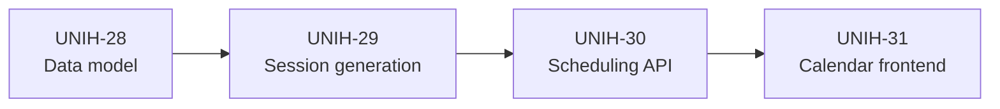
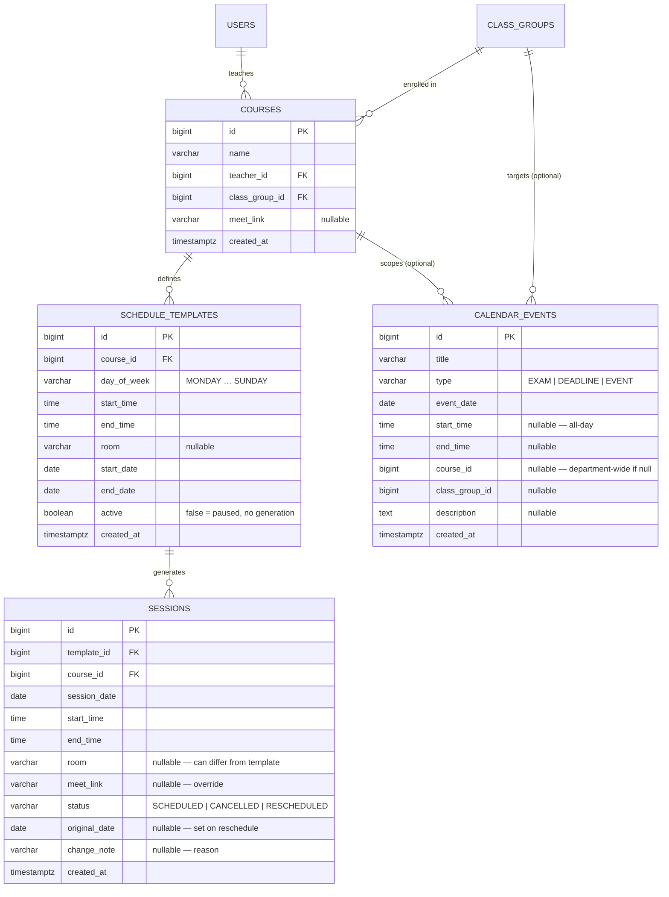
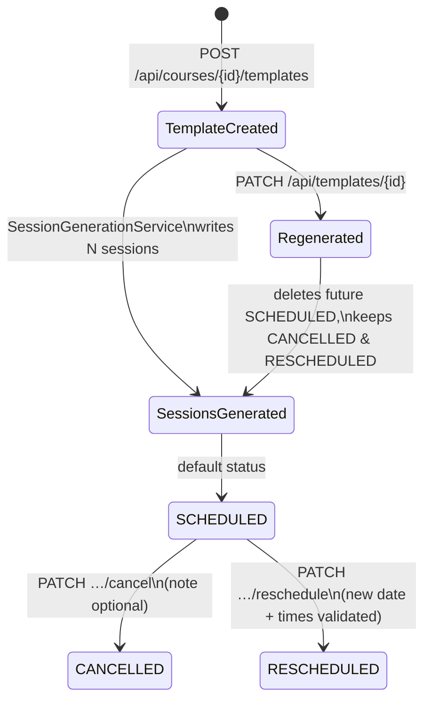
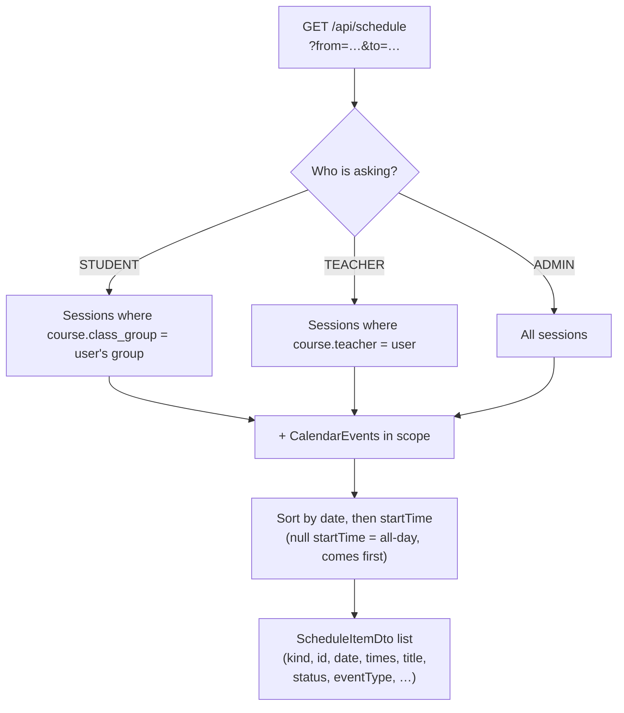
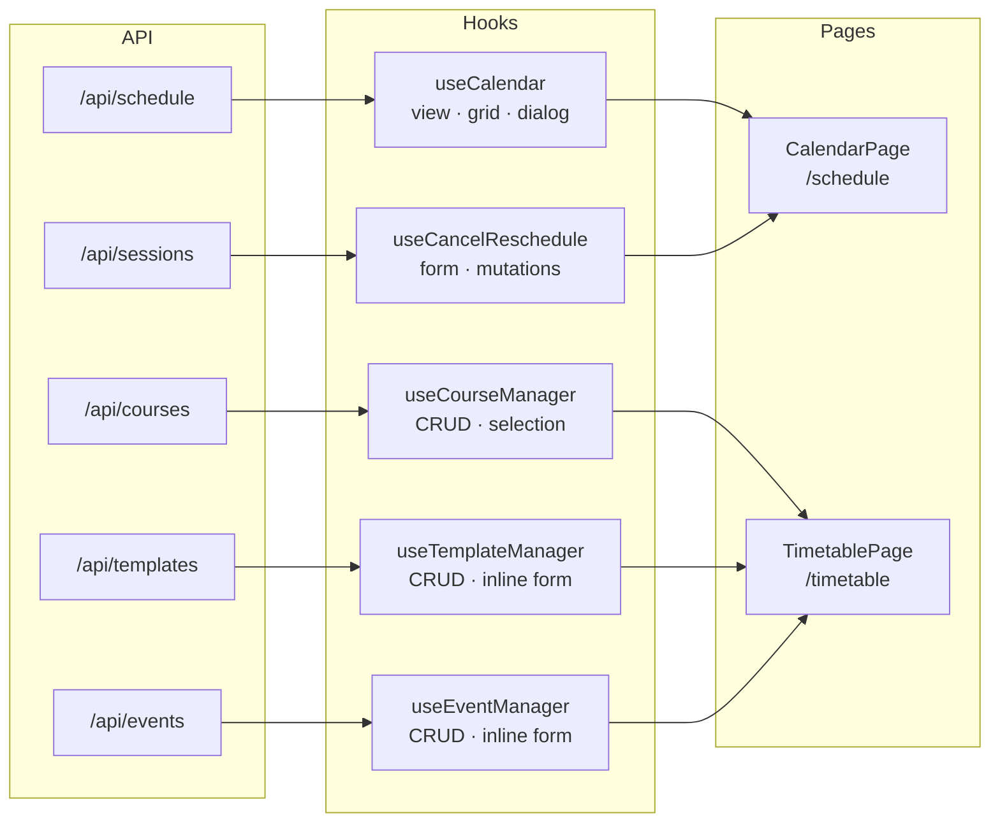

# Epic 4 — Scheduling & Calendar System

**Jira epic:** UNIH-4  ·  **Stories:** UNIH-28 → UNIH-31 (4 stories, all delivered)
**Outcome:** A full academic scheduling system — from the database schema and a recurring-session
generation engine, through a complete REST API, to a React calendar with Today / Week / Month
views and a timetable management interface for teachers and admins.

---

## 1. Goal of the epic

With authentication in place (Epic 2) and the admin console live (part of Epic 3), the next
most visible piece of the application is the schedule. Students need to know what classes are
on today, what is coming up, and when exams or deadlines fall. Teachers need a way to define
their recurring slots, handle exceptions (a cancelled class, a make-up session), and post
one-off events. Admins need to create and assign courses.

Epic 4 delivers exactly this — a coherent scheduling domain from the database up to the
browser, with RBAC enforced at every layer and session state kept accurate as teachers make
real-time adjustments.

## 2. Stories delivered (in implementation order)

The four stories are strictly layered — the data model must exist before the session engine
can write to it, the API must exist before the frontend can call it:

| Story | PR | What it delivered |
|-------|----|-------------------|
| **UNIH-28** — Data model | [#21](https://github.com/ADILRAQ/UNIHUB/pull/21) | Two Flyway migrations (V6–V7): `courses` (name, teacher FK, class-group FK, Meet link); `schedule_templates` (day-of-week recurrence rule, start/end times, room, date range, active flag); `sessions` (generated occurrence, date, times, room, status, original date, change note); `calendar_events` (exam / deadline / event, optional course or group scope, description). Full JPA entities and Spring Data repositories for all four tables. |
| **UNIH-29** — Session generation | [#22](https://github.com/ADILRAQ/UNIHUB/pull/22) | `SessionGenerationService`: iterates the template's date range, picks every matching weekday, and creates one `Session` per occurrence. Regeneration on template edit deletes only future `SCHEDULED` sessions, preserving manually cancelled or rescheduled exceptions. Cancel mutation (status → `CANCELLED`, optional note). Reschedule mutation (status → `RESCHEDULED`, new date/times validated against two rules: target day must not be a normal class day for this template, and the course must have no other session on that date). |
| **UNIH-30** — Scheduling API | [#23](https://github.com/ADILRAQ/UNIHUB/pull/23) | `CourseController` — CRUD, admin-only writes, teachers and students can read. `TemplateController` — per-course create/update/delete (triggers generation); scoped to owning teacher or admin. `SessionController` — cancel and reschedule mutations, 400/409 validation errors surfaced as consistent JSON. `EventController` — CRUD; admins may post department-wide events, teachers must scope to one of their own courses. `ScheduleController` — `GET /api/schedule` returns a single flat, chronologically sorted list of sessions and events filtered to the authenticated user's class group (student) or all courses they own (teacher/admin). |
| **UNIH-31** — Calendar frontend | [#24](https://github.com/ADILRAQ/UNIHUB/pull/24) | `CalendarPage` (`/schedule`, all authenticated users): view switcher (Today / Week / Month), prev/next/today navigation, colour-coded session and event cards with Meet-link buttons, cancel/reschedule dialog for teachers and admins. `TimetablePage` (`/timetable`, TEACHER + ADMIN, route-guarded): course list (admin can create/edit/delete), weekly template manager that triggers session generation on save, one-off event manager. Complete feature-folder architecture with logic hooks, TanStack Query, and all `sched-*` CSS written from scratch. |

## 3. The data model

Four new tables extend the existing `users` and `class_groups` foundation.
`courses` is the central entity — it links a teacher, a class group, and an optional
Google Meet URL. `schedule_templates` define the recurring pattern; `sessions` are the
generated (and exception-carrying) occurrences; `calendar_events` are standalone one-off
entries that can optionally be scoped to a course or a class group.

## 4. Key technical decisions and why

- **Eager session generation, not lazy computation.** Sessions are written to the database
  the moment a template is created or updated, rather than being computed on the fly at
  query time. This keeps `GET /api/schedule` a simple date-range filter, makes cancel and
  reschedule state trivially persistent, and means the schedule is always queryable even if
  the template changes later.

- **Regeneration preserves exceptions.** When a teacher edits a template (changes the time,
  the room, the active flag), the service deletes only future sessions whose status is still
  `SCHEDULED`. Sessions that have already been manually cancelled or rescheduled are left
  untouched — the teacher's earlier decision is not silently overwritten. This was a
  deliberate choice over the simpler "delete all and regenerate", which would lose exception
  history.

- **Cancelled sessions are kept, not deleted.** A cancelled class stays in the database with
  `status = CANCELLED` and continues to appear in the merged schedule feed — with a
  strikethrough in the UI. Students see "today's class is off" rather than an inexplicable
  gap. History is preserved for recap and attendance purposes in later epics.

- **Two validation rules for reschedule.** The target date must (a) not be a normal class
  day for that weekday according to the template, and (b) be free of any other session for
  the same course. Rule (a) enforces the academic convention that make-up classes happen on
  off-days. Rule (b) prevents double-booking. Both produce distinct error codes (400 and
  409) that surface as inline messages in the dialog.

- **Single merged feed at `GET /api/schedule`.** Rather than separate calendar queries for
  sessions and events, one endpoint returns a flat, chronologically sorted list discriminated
  by a `kind` field (`SESSION` | `EVENT`). The frontend needs one TanStack Query call and one
  render loop for all three calendar views. Scoping is handled server-side: students receive
  only their class group's sessions and events; teachers and admins receive all sessions for
  their courses plus any department-wide events.

- **Frontend: logic-hook + thin-UI split throughout.** Every page and every component with
  real logic follows the convention from CLAUDE.md: all state, mutations, derived values
  (the week column grid, the month cell grid, the dialog session), and navigation live in a
  co-located `use<Page>` hook. The page component calls exactly one hook and renders UI from
  the values returned. No business logic lives in JSX.

## 5. How the pieces fit together

**Session generation lifecycle** — from template creation to an exception:

**The merged schedule feed** — how one endpoint serves all three calendar views:

**Frontend data flow** — how each hook maps to an API resource:

## 6. REST API surface

All endpoints follow the existing conventions: consistent JSON error shape from the global
exception handler, DTOs at every boundary (no JPA entities in responses), RBAC enforced at
the controller and service layers.

| Method | Path | Purpose | Roles |
|--------|------|---------|-------|
| `GET` | `/api/schedule` | Merged session + event feed (user-scoped) | ALL |
| `GET` | `/api/courses` | List courses (user-scoped) | ALL |
| `POST` | `/api/courses` | Create a course | ADMIN |
| `PATCH` | `/api/courses/{id}` | Update name, teacher, group, or Meet link | ADMIN |
| `DELETE` | `/api/courses/{id}` | Delete course (cascades to templates → sessions) | ADMIN |
| `GET` | `/api/courses/{id}/templates` | List weekly templates for a course | TEACHER · ADMIN |
| `POST` | `/api/courses/{id}/templates` | Add weekly slot — generates sessions immediately | TEACHER · ADMIN |
| `PATCH` | `/api/templates/{id}` | Update slot — regenerates future SCHEDULED sessions | TEACHER · ADMIN |
| `DELETE` | `/api/templates/{id}` | Delete template and all future SCHEDULED sessions | TEACHER · ADMIN |
| `PATCH` | `/api/sessions/{id}/cancel` | Cancel a session (optional note) | TEACHER · ADMIN |
| `PATCH` | `/api/sessions/{id}/reschedule` | Move to off-day (validated, 400/409) | TEACHER · ADMIN |
| `GET` | `/api/events` | List events for current academic year (user-scoped) | ALL |
| `POST` | `/api/events` | Create event (admin: dept-wide; teacher: own course) | TEACHER · ADMIN |
| `PATCH` | `/api/events/{id}` | Update event title, type, date, times, description | TEACHER · ADMIN |
| `DELETE` | `/api/events/{id}` | Delete event | TEACHER · ADMIN |

## 7. Result

At the end of Epic 4 the scheduling system is live end-to-end. A logged-in student opens
the Calendar page and immediately sees today's sessions and upcoming events colour-coded by
type — class, exam, deadline, cancelled, rescheduled — with a Google Meet join button on
each active session. The Week and Month views give the full picture at a glance.

A teacher opens the Timetable page, selects one of their courses, defines a weekly slot
(e.g. every Tuesday 09:00–11:00 from September to January), and the sessions are generated
automatically. If a class needs to be cancelled, they open the cancel/reschedule dialog
from any card in the calendar; the change is reflected immediately for all students in that
group. Admins can additionally create and assign courses and post department-wide events
visible to the entire student body.

The full stack — data model, session engine, REST API, and React UI — was built in four
stories across approximately ten days and merged to `main` without regressions to the
existing auth or admin features.
