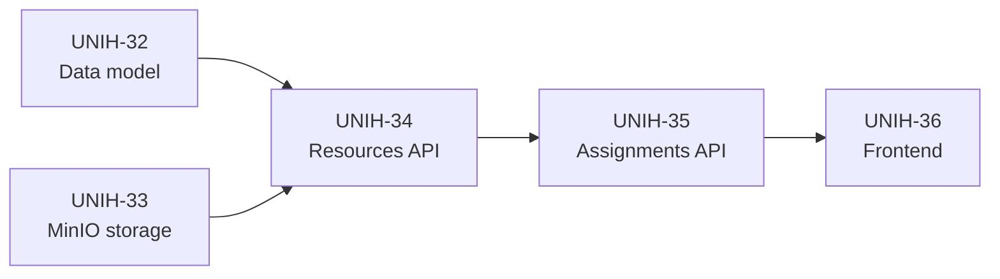
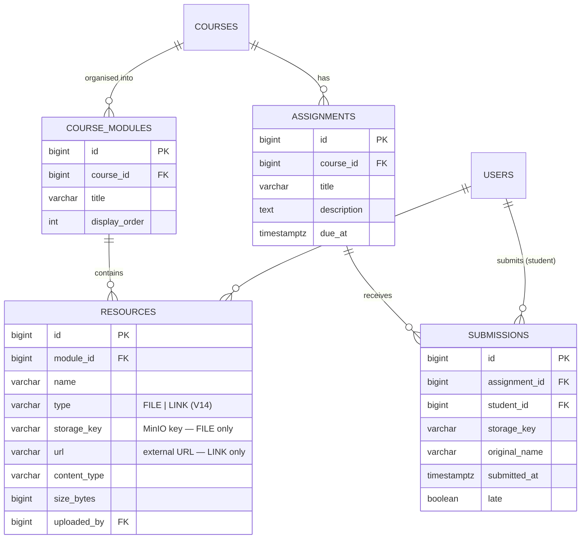
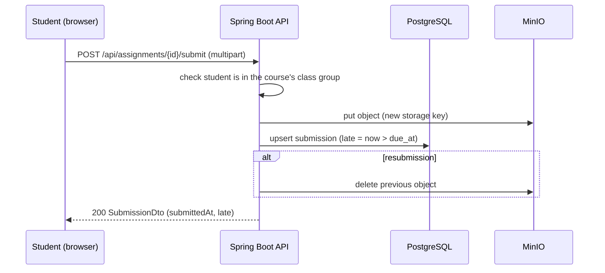

# Epic 5 — Course Resources Management

**Jira epic:** UNIH-5  ·  **Stories:** UNIH-32 → UNIH-36 (5 stories, all delivered)
**Outcome:** Every course now has a structured space for teaching material and homework —
modules (folders) holding files or links stored in MinIO, assignments with due dates, and
a one-submission-per-student homework flow with an automatic late flag and a full roster
for the teacher.

---

## 1. Goal of the epic

With courses and sessions in place (Epic 4), the next need is the material that goes with
them. Before UniHub, slides and exercise sheets were scattered across e-mail, WhatsApp
groups and personal drives, and homework was handed in by e-mail with no clear record of
who submitted what, or when.

Epic 5 gives each course one place for this: teachers organise resources into modules,
publish assignments, and see at a glance who has submitted, who was late and who is
missing. Students browse and download their own courses' material and hand in homework
from the same screen. All files live in object storage (MinIO, S3-compatible), never on the
application server's disk.

## 2. Stories delivered (in implementation order)

| Story | PR | What it delivered |
|-------|----|-------------------|
| **UNIH-32** — Data model | [#31](https://github.com/ADILRAQ/UNIHUB/pull/31) | Flyway `V9`: `course_modules`, `resources`, `assignments`, `submissions` with FK chains and indexes for course and due-date lookups. `UNIQUE(assignment_id, student_id)` on `submissions` makes "resubmission replaces" a database guarantee. JPA entities and repositories. |
| **UNIH-33** — MinIO storage | [#32](https://github.com/ADILRAQ/UNIHUB/pull/32) | `StorageService` (MinIO Java SDK): streaming upload / download / delete, bucket auto-created on startup, typed 400 errors for oversized or forbidden files (50 MB resources, 10 MB proofs). Endpoint and credentials come from environment variables only — the same code works against real S3. |
| **UNIH-34** — Resources API | [#33](https://github.com/ADILRAQ/UNIHUB/pull/33) | Module CRUD, multipart resource upload, streamed download with `Content-Disposition: attachment`, delete (DB row **and** MinIO object), and `GET /api/resources/search?q=` across the caller's accessible courses. |
| **UNIH-35** — Assignments API | [#34](https://github.com/ADILRAQ/UNIHUB/pull/34) | Assignment CRUD; student submit as an upsert (the old MinIO object is deleted on resubmission); `late` computed against `due_at` at submit time; teacher roster listing **every** enrolled student as `SUBMITTED`, `LATE_SUBMITTED` or `MISSING`. |
| **UNIH-36** — Frontend | [#37](https://github.com/ADILRAQ/UNIHUB/pull/37) | `CoursesPage` (card grid) and `CoursePage` (module accordion, resource items, assignment items with student upload and teacher `SubmissionsTable`). Upload/delete controls hidden from students. All data via the shared TanStack Query hooks. |

A later polish change (migration `V14`) added **link resources**: a resource is either a
`FILE` (stored in MinIO) or a `LINK` (an external URL, e.g. a YouTube video or a Google
Doc), enforced by a `CHECK` constraint.

## 3. The data model

## 4. Key technical decisions and why

- **Object storage, never the local filesystem.** The database stores only a `storage_key`;
  the bytes live in MinIO. Containers stay stateless, so the API can be redeployed or scaled
  without losing files, and switching to AWS S3 later is a configuration change.

- **Streaming in both directions.** Uploads are passed straight to MinIO and downloads use
  `StreamingResponseBody`, so a 50 MB file never sits fully in the API's memory.

- **Resubmission is an upsert, backed by a unique constraint.** One row per
  (assignment, student) is guaranteed by the database, not just by application code.
  Resubmitting overwrites the row, recomputes `late`, and deletes the previous file from
  MinIO so no orphaned objects accumulate.

- **The roster is computed from enrolment, not from submissions.** `GET
  /api/assignments/{id}/submissions` starts from the class group's students and joins their
  submission (if any). A student who never submitted therefore appears as `MISSING` —
  which is the information a teacher actually needs.

- **Access is checked on the server for every call.** Teachers may only write to their own
  courses (403 otherwise), students only see courses of their class group, and a student
  can only ever read their own submission. The UI hiding buttons is a convenience, not the
  security boundary.

## 5. How the pieces fit together

**Homework submission flow:**

## 6. REST API surface

| Method | Path | Purpose | Roles |
|--------|------|---------|-------|
| `GET` / `POST` | `/api/courses/{id}/modules` | List / create modules | ALL / TEACHER · ADMIN |
| `PATCH` / `DELETE` | `/api/modules/{id}` | Update / delete a module | TEACHER · ADMIN |
| `GET` / `POST` | `/api/modules/{id}/resources` | List / upload files | ALL (scoped) / TEACHER · ADMIN |
| `POST` | `/api/courses/{cid}/modules/{mid}/resources/link` | Add a link resource | TEACHER · ADMIN |
| `GET` | `/api/resources/{id}/download` | Stream a file | ALL (scoped) |
| `DELETE` | `/api/resources/{id}` | Delete resource and its MinIO object | TEACHER · ADMIN |
| `GET` | `/api/resources/search?q=` | Search across accessible courses | ALL (scoped) |
| `GET` / `POST` | `/api/courses/{id}/assignments` | List / create assignments | ALL / TEACHER · ADMIN |
| `PATCH` / `DELETE` | `/api/assignments/{id}` | Edit / delete an assignment | TEACHER · ADMIN |
| `POST` | `/api/assignments/{id}/submit` | Submit or resubmit homework | STUDENT |
| `GET` | `/api/assignments/{id}/my-submission` | Own submission | STUDENT |
| `GET` | `/api/assignments/{id}/submissions` | Full roster with status | TEACHER · ADMIN |
| `GET` | `/api/submissions/{id}/download` | Download a submission | TEACHER · ADMIN (own course) |

## 7. Result

At the end of Epic 5 a teacher opens a course, creates modules such as "Week 1 — Intro",
drops in PDFs or links, and publishes an assignment with a deadline. Students of that class
group see the material immediately, download it, and hand in their work from the same page;
submitting after the deadline is allowed but flagged as late. The teacher's roster shows
every student of the group with a clear submitted / late / missing status and a download
button, replacing the e-mail inbox as the record of who handed in what.
