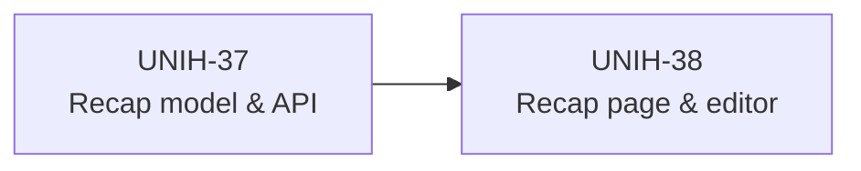
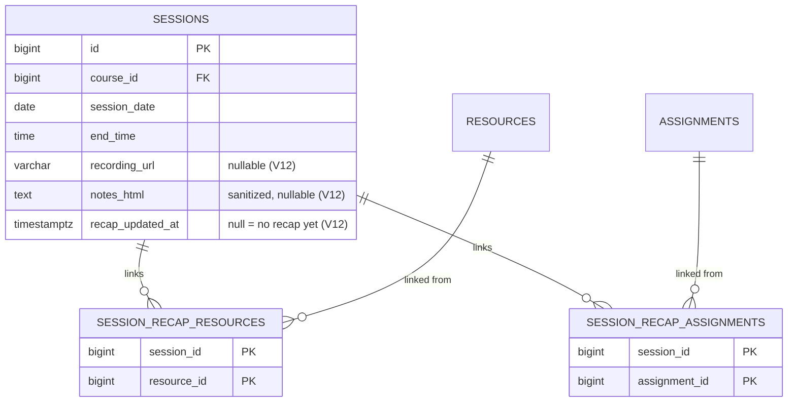
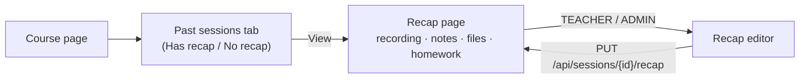

# Epic 6 — Missed Class Recovery (Session Recaps)

**Jira epic:** UNIH-6  ·  **Stories:** UNIH-37 → UNIH-38 (2 stories, all delivered)
**Outcome:** Every past class session can carry a recap — a recording link, sanitized notes,
and links to the course resources and assignments covered that day — so a student who
missed a class can catch up in two clicks.

---

## 1. Goal of the epic

Students miss classes: illness, transport, overlapping obligations. Before UniHub, catching
up meant asking classmates for notes and hunting for the right slides. Epic 6 attaches a
recap to the session itself (the dated occurrence from Epic 4) and links it to material
that already exists in the course (Epic 5). Nothing is duplicated — the recap *points to*
existing resources and assignments.

## 2. Stories delivered

| Story | PR | What it delivered |
|-------|----|-------------------|
| **UNIH-37** — Recap model & API | [#44](https://github.com/ADILRAQ/UNIHUB/pull/44) | Flyway `V12`: recap columns on `sessions` (`recording_url`, `notes_html`, `recap_updated_at`) plus two join tables linking a session to resources and assignments. `SessionRecapService` with a full-replace `PUT`, a `GET`, and a past-sessions list with a `hasRecap` flag. Notes sanitized server-side with the same Jsoup whitelist as announcements. |
| **UNIH-38** — Frontend | [#47](https://github.com/ADILRAQ/UNIHUB/pull/47) | Recap page (`/sessions/:id/recap`, all roles): recording link, notes, downloadable resources, assignment links, and a "not filled yet" empty state. Teacher editor (`/sessions/:id/recap/edit`, route-guarded) pre-filled from the existing recap. A **Past sessions** tab on the course page with a "Has recap / No recap" badge. |

A follow-up fix ([#51](https://github.com/ADILRAQ/UNIHUB/pull/51)) makes a session count
as "past" as soon as it has **ended** today (previously only from the next day), evaluated in
the department's timezone (`Africa/Casablanca`) — so a teacher can publish the recap right
after class.

## 3. The data model

The recap is not a separate entity: a session has at most one recap, so its scalar fields
live on the `sessions` row. `recap_updated_at` doubles as the "has recap" flag.

## 4. Key technical decisions and why

- **Columns on `sessions`, not a `recaps` table.** One-to-one data with no life of its own
  does not need its own table; it avoids a join on every read and an "orphan recap" state.

- **Full-replace `PUT`.** The editor always sends the complete recap (URL, notes, linked
  IDs). The server replaces everything in one transaction, so there is no partial-update
  logic and no way for link lists to drift.

- **Linked items must belong to the same course.** Linking a resource or assignment from
  another course is rejected with 400 — a recap can never leak material across courses.

- **Server-side HTML sanitization.** Notes are rich text; they are cleaned with the same
  whitelist used for announcements before being stored, and the frontend renders only the
  sanitized HTML.

- **Access follows the course.** Only the owning teacher (or an admin) can edit; only
  students of the course's class group can read — a student from another group gets 403.

## 5. How the pieces fit together

After a save the editor invalidates the recap query, so the student view reflects the change
immediately.

## 6. REST API surface

| Method | Path | Purpose | Roles |
|--------|------|---------|-------|
| `PUT` | `/api/sessions/{id}/recap` | Create/replace a recap | ADMIN, owning TEACHER |
| `GET` | `/api/sessions/{id}/recap` | Read a recap | ADMIN, owning TEACHER, enrolled STUDENT |
| `GET` | `/api/courses/{id}/sessions?past=true` | Past sessions with `hasRecap` | ADMIN, owning TEACHER, enrolled STUDENT |

## 7. Result

A student who missed Tuesday's class opens the course, goes to **Past sessions**, and sees
that Tuesday has a recap. One click shows the recording, the teacher's notes, the slides
used and the homework given that day. The teacher fills this in from a single form right
after class, reusing files already uploaded to the course.
