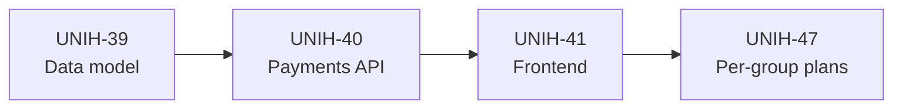
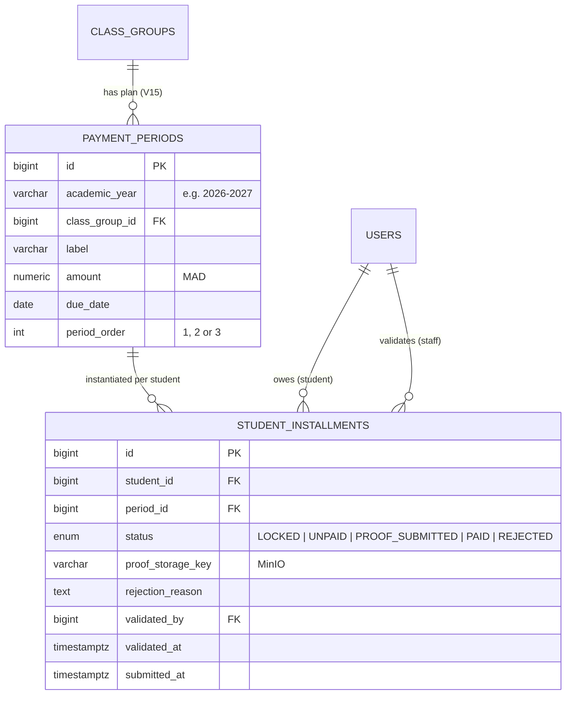
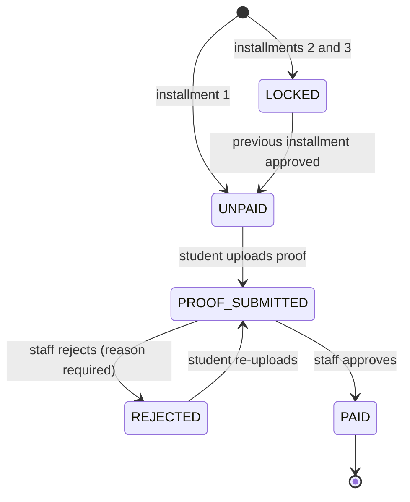

# Epic 7 — Payments Tracking (3 Installments)

**Jira epic:** UNIH-7  ·  **Stories:** UNIH-39 → UNIH-41, UNIH-47 (4 stories, all delivered)
**Outcome:** Tuition is tracked as three sequential installments per academic year and per
class group. Students upload a proof of payment (image or PDF) for the current installment;
teachers and admins validate or reject it from a queue, and approval unlocks the next
installment. Overdue students are listed automatically. No money moves through the app.

---

## 1. Goal of the epic

Tuition in the department is paid in three installments, by bank transfer or at the
cashier. Tracking it meant collecting receipts by hand and keeping spreadsheets up to date.
Epic 7 digitises the **tracking**, not the payment: students upload their receipt, staff
validate it, and everyone can see where each student stands. Online payment processing is
explicitly out of scope (see CLAUDE.md, "Product scope guards").

## 2. Stories delivered

| Story | PR | What it delivered |
|-------|----|-------------------|
| **UNIH-39** — Data model | [#35](https://github.com/ADILRAQ/UNIHUB/pull/35) | Flyway `V10`: `payment_periods` (the plan: label, amount, due date, order 1–3) and `student_installments` (one per student per period) with a PostgreSQL enum status. New students automatically get installments for existing plans. |
| **UNIH-40** — Payments API | [#36](https://github.com/ADILRAQ/UNIHUB/pull/36) | Plan creation (exactly 3 periods), student proof upload (image/PDF ≤ 5 MB, stored in MinIO, old proof replaced), validation queue, approve / reject-with-reason, sequential unlock, and the overdue report. |
| **UNIH-41** — Frontend | [#38](https://github.com/ADILRAQ/UNIHUB/pull/38) | Student view: three installment cards (locked / to pay / under review / paid / rejected, with an overdue badge) and proof upload on the current card only. Staff view: tabs for the proof queue (preview, approve, reject with reason), the overdue list, and plan creation. |
| **UNIH-47** — Per-group plans | [#50](https://github.com/ADILRAQ/UNIHUB/pull/50) | Tuition differs by class group, so a plan now belongs to one class group (`V15`). Academic-year selector (current or next year), students see only the current year, amounts shown in Moroccan dirham (MAD), all dates computed in `Africa/Casablanca`. Teachers got the same payment and student-management capabilities as admins. |

Supporting migrations: `V11` (period order type fix) and `V13` (enum renamed to match
Hibernate's mapping). PR [#49](https://github.com/ADILRAQ/UNIHUB/pull/49) added an empty
state for students whose group has no plan yet.

## 3. The data model

`UNIQUE(academic_year, class_group_id, period_order)` guarantees one plan per group per
year; `UNIQUE(student_id, period_id)` guarantees one installment per student per period.

## 4. Key technical decisions and why

- **Sequential slots as a state machine.** Installment 1 starts `UNPAID`, 2 and 3 start
  `LOCKED`. Only an `UNPAID` or `REJECTED` installment accepts a proof, and approving
  installment *N* unlocks *N + 1*. This matches the agreed rule "only the current slot
  accepts a proof upload; validation opens the next slot".

- **Overdue is derived, never stored.** An installment is overdue when its due date has
  passed and it is still `UNPAID` or `REJECTED`. Computing it at read time means there is no
  nightly job and nothing to get out of sync. Locked and under-review installments are
  never counted as overdue.

- **Per-class-group plans (UNIH-47).** Different programmes pay different amounts. Making
  the plan belong to a class group — rather than adding per-student overrides — kept the
  model simple and matched how the department actually sets fees. `V15` wiped the earlier
  global plans, which were development data only (agreed beforehand).

- **Department timezone.** Servers run in UTC, but "is this overdue?" and "which academic
  year is it?" must follow Moroccan time. Every "today" is computed in `Africa/Casablanca`
  through one shared constant. Academic years run 1 September to 31 August.

- **Proofs are private files.** Proof images go to MinIO and are only streamed to staff;
  re-uploading after a rejection deletes the previous file.

## 5. How the pieces fit together

**Installment lifecycle:**

## 6. REST API surface

| Method | Path | Purpose | Roles |
|--------|------|---------|-------|
| `GET` | `/api/payments/me` | Own installments, current academic year | STUDENT |
| `POST` | `/api/payments/{id}/proof` | Upload proof (image/PDF ≤ 5 MB) | STUDENT |
| `GET` | `/api/payments/periods` | All plans, by year then class group | TEACHER · ADMIN |
| `POST` | `/api/payments/periods` | Create a 3-installment plan for a group and year | TEACHER · ADMIN |
| `GET` | `/api/payments/pending-proofs` | Validation queue | TEACHER · ADMIN |
| `GET` | `/api/payments/{id}/proof` | Stream a proof file | TEACHER · ADMIN |
| `PUT` | `/api/payments/installments/{id}/approve` | Approve (unlocks next) | TEACHER · ADMIN |
| `PUT` | `/api/payments/installments/{id}/reject` | Reject with a reason | TEACHER · ADMIN |
| `GET` | `/api/payments/overdue[?classGroupId=]` | Overdue students | TEACHER · ADMIN |

## 7. Result

At the start of the year a staff member creates, for each class group, a plan of three
installments with amounts in MAD and due dates. Every student of the group immediately sees
their three cards, with only the first one open. After paying at the bank, the student
photographs the receipt and uploads it; it lands in the validation queue, where staff
preview it and approve or reject it with a reason. Approval opens the next installment, and
the overdue list always shows who is late, filterable by class group.
