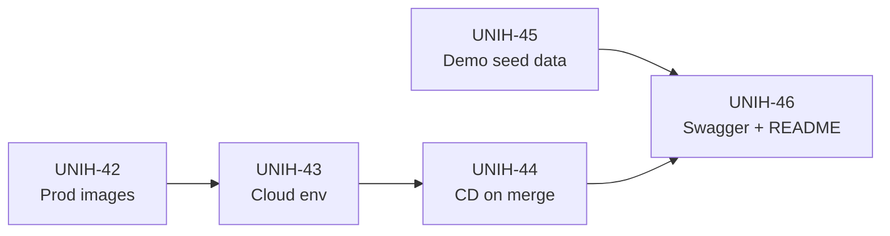
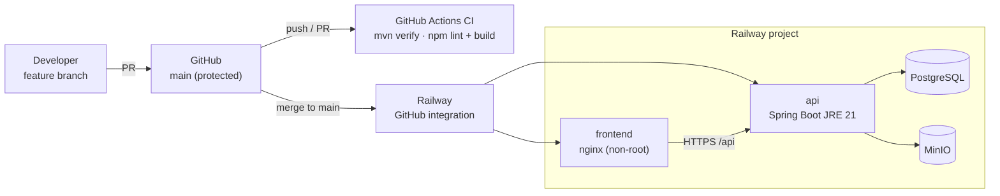

# Epic 9 — Deployment, Docs & Delivery

**Jira epic:** UNIH-9  ·  **Stories:** UNIH-42 → UNIH-46 (5 stories)
**Outcome:** UniHub ships as hardened production Docker images, deploys automatically to
Railway on every merge to `main`, seeds a complete demo dataset with jury accounts, and
documents its whole API in Swagger UI alongside a README written for the jury.

---

## 1. Goal of the epic

Epics 1–7 produced a working application on developer machines. Epic 9 turns it into
something a jury can **open, log into and evaluate**: small and safe production images, a
cloud environment, continuous deployment with no manual step, realistic demo data, and
documentation good enough that the README alone explains how to run and use the project.

## 2. Stories delivered

| Story | PR / commit | What it delivered |
|-------|-------------|-------------------|
| **UNIH-42** — Production images | [#43](https://github.com/ADILRAQ/UNIHUB/pull/43) | Multi-stage builds. Backend: Maven build → `eclipse-temurin:21-jre-alpine`. Frontend: Node build → `nginx:1.27-alpine` with SPA fallback and gzip. Both run as a non-root `app` user with a healthcheck; base images pinned. `docker-compose.prod.yml` to run the production images locally. |
| **UNIH-43** — Cloud environment | `8e8f6b5` | Railway project with four services (API, frontend, PostgreSQL, MinIO). `backend/railway.toml` and `frontend/railway.toml` build each service from its Dockerfile, with healthchecks and restart-on-failure; `VITE_API_URL` is injected as a build argument. Secrets live in Railway variables only. |
| **UNIH-44** — Continuous deployment | [#45](https://github.com/ADILRAQ/UNIHUB/pull/45), `08cb692` | First built as a GitHub Actions job pushing images to Docker Hub and calling Render deploy hooks. When hosting moved to Railway, the job was removed: Railway's GitHub integration deploys every push to `main`, while GitHub Actions stays the build/lint gate. |
| **UNIH-45** — Demo seed data | [#48](https://github.com/ADILRAQ/UNIHUB/pull/48) | `DemoDataSeeder` (dev profile, runs after `AdminSeeder`) idempotently seeds courses, sessions, announcements, resources, assignments, payments and recaps, so every feature has data on first boot. Jury accounts are listed in the README. |
| **UNIH-46** — API docs & README | [#46](https://github.com/ADILRAQ/UNIHUB/pull/46) | Springdoc OpenAPI with Swagger UI at `/api/swagger-ui.html`, every controller tagged, JWT bearer scheme so endpoints can be tried from the browser. README rewritten for the jury: overview, stack, architecture, quick start, demo credentials, environment variables, features. |

## 3. Deployment architecture

Flyway migrations run automatically when the API starts, so a deploy that contains a new
`V{n}__*.sql` migrates the production database before serving traffic.

## 4. Key technical decisions and why

- **Multi-stage images, non-root, pinned bases.** Build tools never reach the runtime
  image, which keeps images small and removes compilers from the attack surface. Pinned
  versions make builds reproducible; nginx listens on 8080 so it doesn't need root.

- **Railway instead of Render.** Railway hosts managed PostgreSQL alongside the app and
  deploys directly from GitHub, which removed the Docker Hub registry and the deploy-hook
  secrets from the pipeline. The CI workflow is now only the quality gate — simpler, with
  fewer secrets to manage.

- **Build-only CI.** As agreed for v1 there is no automated test suite: every PR must pass
  `mvn verify` and `npm run lint && npm run build`, and a mandatory code review against the
  story's acceptance criteria is the functional quality gate.

- **Idempotent seeding.** The seeders check before inserting, so restarting the stack never
  duplicates data, and the demo dataset is only loaded in the `dev` profile.

- **Documentation that lives with the code.** Swagger is generated from the controllers, so
  it cannot drift from the real API; environment variables are documented in the README
  table as the single reference.

## 5. Status of acceptance criteria

| Story | Status |
|-------|--------|
| UNIH-42 | All criteria met |
| UNIH-43 | Met — Railway production deployments succeed on every merge (GitHub deployment history) |
| UNIH-44 | Met — delivered through Railway auto-deploy instead of the original Render hook job |
| UNIH-45 | All criteria met |
| UNIH-46 | AC1 (Swagger) and AC2 (README) met. **AC3, the smoke checklist on the live URL, is still to be run and recorded.** |

## 6. Result

A merge to `main` is now the only step needed to release: CI checks the build, Railway
rebuilds the images and redeploys, and Flyway migrates the database on startup. A jury
member can read the README, start the whole stack locally with `docker compose up`, log in
with one of the documented demo accounts, find every feature already populated with data,
and explore the full API interactively in Swagger UI — or open the deployed app on Railway.
